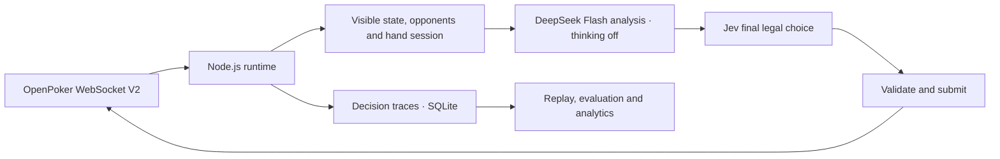

# jev-card-agent

[English](README.md) · [简体中文](README.zh-CN.md)

**An autonomous poker agent and decision-model evaluation platform powered by Jev, competing against real bots on OpenPoker.ai.**

[Watch the live arena and decision replay →](https://openpoker.zve.ccwu.cc)

Built with **Node.js 24, TypeScript, Fastify, React/Vite and SQLite**. OpenPoker provides six-max No-Limit Texas Hold’em, matchmaking, legal-action constraints and settlement. This project runs the self-hosted WebSocket V2 agent, records its decisions and evaluates its behavior.

## What you can inspect

| View               | What it shows                                                                                                              |
| ------------------ | -------------------------------------------------------------------------------------------------------------------------- |
| Overview           | Net profit, profitable-hand win rate, season score and score / profit curves                                               |
| Live table         | Community cards, the Bot’s own hole cards, all reported seat stacks, dealer button, chip animations and decision progress  |
| Replay & decisions | Events at each replay step, frozen inputs, legal candidates, model outputs, selected actions and execution acknowledgments |
| Evaluations        | Saved comparisons between Jev, the combined policy and baselines, with individual disagreements                            |
| Account funding    | Official account snapshots, freshness, auto-rebuy status, known cooldowns and persistent funding-event history             |

The public website is **anonymous and read-only**. It exposes the Bot’s own current hand and saved decisions for that hand, plus recorded completed hands. It has no Bot controls, strategy editing, key entry or paid-evaluation triggers. Visitors cannot change decision logic. Unrevealed opponent cards, action tokens and credentials remain private.

Live SSE updates and reconnects automatically. Every player’s displayed stack and the dealer button follow server state; sparse player summaries preserve seats they do not mention. Animations illustrate events without calculating authoritative balances. Older runs and hands load in pages of 100.

Overview focuses on the selected run’s results across its full recorded history. Win rate is the share of verified hands with positive net profit; break-even hands remain in the denominator. Season score comes from recorded official account snapshots and includes rebuys, while net profit excludes funding. Both curves refresh automatically. Account details and funding events are shown below the table in Live; individual hands remain in Replay.

## How decisions work



The selected deployment target is `jev-reasoning` with `REASONING_MODE=always`: request analysis from **DeepSeek-V4.1-Flash (`deepseek-flash`) with thinking disabled** for each valid decision, then let Jev choose the final legal candidate. `always` controls whether analysis is requested; it does not enable thinking. DeepSeek cannot submit actions. Pure `jev`, a rule-based `baseline`, and explicitly configured `adaptive` analysis remain available for comparison.

The dedicated **DeepSeekProvider** uses official Anthropic-compatible Messages, with a 10-second timeout per analysis attempt. GPT and Claude are not automatic fallback providers. Standard Responses / Messages adapters remain available for explicit experiments. The owner has selected this target; deployment and live validation status are recorded separately in the [verification report](docs/verification.md).

Each hand has a persistent session. Inputs include visible action history, opponent statistics with sample counts, recent verified results and earlier decisions from that same hand, bounded by the current decision’s cutoff. Replay preserves the saved input rather than adding later information.

Each provider gets an initial attempt and **at most three retries**, sharing the action deadline and persistent cost budget. Attempts, failures, known usage and unknown-cost reservations are recorded separately. Analysis failure lets Jev decide within the remaining time; if no valid model result arrives in time, the runtime records a legal fallback. Model identity mismatches, authentication failures and budget or ledger failures are not blindly retried.

Decision views show saved analysis, the thinking text or summary actually returned by the provider, Jev probabilities and the final choice. Missing thinking is marked unavailable; the application does not invent it. Jev probabilities are not poker equity or expected profit.

## Account chips and rebuys

The backend reads OpenPoker `season/me` when the runtime starts, every **15 seconds** while running, and after relevant events. The UI distinguishes off-table account chips, the REST account-at-table snapshot, live WebSocket seat stacks and historical net results. Failed refreshes retain the last value with a stale marker; unknown values are not displayed as zero.

A public-season rebuy credits **1,500 virtual chips** off table. Eligibility requires being off table, no chips at a table and fewer than 1,000 available chips; the first rebuy is immediate, with later cooldowns of 5 minutes on Free or 2 minutes on Pro. After confirmation, the runtime reloads the official balance before joining again. It does not add chips locally or count rebuys as poker profit.

Rebuy confirmations, scheduled cooldowns and balance reconciliations are stored in SQLite and shown in the public funding history. Restarting restores recorded history. Missing prior balances remain unknown, and observation counts are not presented as an exact count of platform transactions. See the [funding contract](docs/running.md#账户筹码牌桌筹码与自动补筹).

## Try the local demo

Requires **Node.js 24.x** and npm.

```sh
npm ci
npm run demo
```

Open **http://127.0.0.1:8787**. This builds the application and uses synthetic data in `data/demo.sqlite`, without API keys, real matchmaking or paid model calls. Demo, recorded history and live Arena data are labeled separately.

## Run a real agent

```sh
cp -n .env.example .env
chmod 600 .env
```

Fill in `OPEN_POKER_API_KEY`, `JEV_API_KEY` and the independent `DEEPSEEK_API_KEY` in your private `.env`. Configure an independent `API_TOKEN` for internal administration; the browser never receives it. See the [configuration guide](docs/running.md) for protocols, models, timeouts and budgets.

```sh
# Check platform authentication without joining a table.
npm run diagnose

# Join real matches with bounded runtime and model spending.
npm run bot -- --strategy jev-reasoning --max-hands 10 --max-minutes 30 --budget-usd 1
```

To serve the website and agent together, configure:

```dotenv
PUBLIC_HISTORY=true
AUTO_START_BOT=true
BOT_STRATEGY=jev-reasoning
REASONING_MODE=always
REASONING_PROVIDER=deepseek
DEEPSEEK_API_BASE_URL=https://api.deepseek.com/anthropic
DEEPSEEK_MODEL=deepseek-flash
DEEPSEEK_THINKING=disabled
REASONING_TIMEOUT_MS=10000
REASONING_MAX_OUTPUT_TOKENS=4096
HYBRID_TIMEOUT_MS=40000
JEV_TIMEOUT_MS=3000
```

Set these values explicitly after copying `.env.example`; library defaults do not select this deployment target. DeepSeek uses its own key and model settings. With `DEEPSEEK_THINKING=disabled`, no effort parameter is sent, even if `REASONING_EFFORT=high` remains in an older environment. See the [provider contract](docs/transports.md#deepseek-messages-专用合同).

Then run `npm run build` and `npm run start`. Without auto-start, the server only serves the console. The standalone `bot` command is a separate entry point; use one runtime per Bot and database. Real model calls cost money, and hand/time limits do not guarantee that many hands will finish.

## Deploy and operate

Docker Compose runs the application with a persistent SQLite volume. From the deployment directory:

```sh
sh scripts/manage.sh start
sh scripts/manage.sh status
sh scripts/manage.sh logs
sh scripts/manage.sh backup
sh scripts/manage.sh stop
sh scripts/manage.sh restart
sh scripts/manage.sh update
```

`stop`, `restart` and `update` wait for the current hand to finish and confirm departure before replacing the process. `restart` uses the existing image; `update` pulls the configured image. Existing containers are left running by `start`.

GitHub Actions checks the project and automatically publishes **uncached `linux/amd64` and `linux/arm64` images**, pulling a fresh base image. **Server updates remain manual.** Normal updates preserve history and the model-cost ledger. See [deployment](docs/deployment.md) and [image releases](docs/docker-release.md).

A deliberately fresh run follows the [documented reset procedure](docs/deployment.md#经明确要求开始全新运行): validate and publish the new image, drain and stop the old runtime, take a private consistent backup, then clear old public run/hand/decision data and recovery checkpoints offline. Preserve the cost ledger and unknown reservations. This does not reset model spending or erase OpenPoker’s records; it is not a website control.

## Development and verification

```sh
npm run dev
npm run check
npx playwright install chromium
npm run test:e2e
```

Development uses Vite at `http://127.0.0.1:5173` and the API at `http://127.0.0.1:8787`. Production serves the UI, API and runtime from one Node.js process. Checks cover formatting, lint, types, unit/integration tests, build output, file-size limits and credential hygiene. Browser tests use synthetic data and do not spend model credits. Maintained text files stay below 1,000 lines.

Real Arena runs and provider calls are documented, but they do not establish long-term profitability or a strategy advantage. Recent Opus 5 and Sonnet 5 probes using `high` timed out during analysis; they verified legal Jev continuation, **not successful high-effort analysis**. Saved provider thinking may be absent. Current evidence and limitations are in the [verification report](docs/verification.md).

## Documentation

- [Architecture and scope](docs/architecture.md)
- [Evaluation methodology and budgets](docs/evaluation.md)
- [OpenPoker and model contracts](docs/transports.md)
- [Running, configuration and backups](docs/running.md)
- [Server deployment and manual updates](docs/deployment.md)
- [Docker image publishing](docs/docker-release.md)
- [Actual verification and limitations](docs/verification.md)
- [Contributing](CONTRIBUTING.md)

Detailed project documents are currently in Chinese. `.env`, credentials, raw databases and private deployment records stay outside public source and images.

Protocol sources: [OpenPoker Docs](https://docs.openpoker.ai/) · [TypeSafe API](https://docs.typesafe.ai/api).
