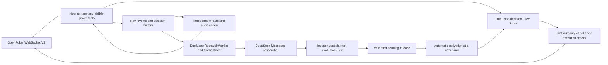

# jev-card-agent

[English](README.md) · [简体中文](README.zh-CN.md)

**An autonomous poker agent and decision-model evaluation platform powered by Jev, competing against real bots on OpenPoker.ai.**

[Public demo, live table and replay →](https://openpoker.zve.ccwu.cc) · [DuelLoop framework](https://github.com/hewenyu/DuelLoop)

Node.js 24, TypeScript, Fastify, React/Vite and SQLite. OpenPoker supplies real six-max No-Limit Texas Hold’em, matchmaking, legal actions, settlement and season scores. This application connects through WebSocket V2; it does not replace the Arena server.

**v2.0.4 is deployed at the [public observatory](https://openpoker.zve.ccwu.cc), using the official DuelLoop v0.2.3 release package.** DuelLoop manages the live decision and strategy-research lifecycle. The [deployment acceptance record](docs/deployment-acceptance-v2.0.4.md) records the 2026-09-26 rollout, Jev HTTP 403 retries, production recovery and verification limits; [earlier verification](docs/duelloop-refactor-verification.md) remains historical evidence.

## What visitors see

| View                   | Content                                                                                                                                                                  |
| ---------------------- | ------------------------------------------------------------------------------------------------------------------------------------------------------------------------ |
| Overview               | Verified net chips, profitable-hand rate, official season score and profit/score curves                                                                                  |
| Live table             | The table first, Bot cards, dealer, every reported seat’s available chips and current bet, chip animations, current-hand decisions and the official OpenPoker table link |
| Replay & decisions     | Recorded events, actual model inputs, legal candidates, Score answers, release/facts bindings and execution results                                                      |
| Strategy research      | Background lifecycle, request counts, validation references and pending releases; current hand and active releases shown separately                                      |
| Historical evaluations | Read-only legacy comparisons; action agreement is not alternative-action profit                                                                                          |

The public site is **anonymous and read-only**. Keys, action-authority tokens, unrevealed opponent cards and private research artifacts are not public. Bot controls and strategy approval remain authenticated backend operations. Refresh uses SSE and bounded HTTP queries; the browser does not operate the Bot.

Available chips, street bets, account balance and official season score are separate quantities. Overview and Live share the latest official score observation. Rebuys do not count as poker profit. Win rate means verified hands with positive net profit divided by all verified hands, including break-even hands; it is not model accuracy.

## One live decision path, two independent loops



- **Jev decides every live action.** The SDK obtains real Score answers for priced legal candidates, combines them using the versioned strategy and selects an action. The reviewed baseline uses argmax. Score levels are ordinal assessments, not chip EV or poker equity; argmax’s one-hot selection probability is not model confidence.
- **Each hand pins a release and historical facts snapshot.** Current cards, bets and actions continue updating. Reconnects and restarts reuse the same binding; a new release or rollback affects future unpinned hands. Missing original facts cannot be replaced with today’s evidence.
- **The host alone sends actions.** SDK intent, application journal, turn identity, lease, legal amount and original deadline must all agree. Acknowledgment and completed execution are distinct, duplicate receipts are deduplicated and unknown execution blocks the stream.
- **No local decision fallback.** Jev uses an initial request plus at most three retries: 10 seconds per request and a 40-second decision window by default, bounded by original Arena authority and a submission reserve. Invalid/stale results are not reused. Genuine decision failures preserve a stop requiring explicit recovery.
- **Research never delays the current action.** Deterministic facts/audits run separately. The isolated LLM worker uses SDK-frozen evidence, controlled tools, cancellation, recovery and independent development/final evaluation. It receives model credentials for research/evaluation, but no Arena execution key.
- **Research registration is not activation.** Only an eligible final validation can register a research release. Default activation is automatic after independent final validation, at the next unbound hand; the public site cannot change this policy or roll back. Interrupted paid work is not silently replayed, corrections to an old settlement do not count as new hands, and inconclusive evaluation leaves the current strategy in place.

The initial bootstrap strategy is explicitly enabled but has not passed independent statistical validation. Deployment acceptance confirms operation, not profitability.

There is **no monetary budget gate**. Usage and incomplete dollar amounts remain auditable. Time, token, request and evaluation-call bounds prevent runaway research; unknown token usage can stop that research task because its resource use cannot be established. This does not infer a provider account balance or invent a zero charge.

Baseline/Choice/Hybrid implementations remain isolated for offline comparisons and historical records. `BOT_STRATEGY=baseline` and `jev-reasoning` are rejected for real play. The old advice queue and publisher are not started by production controllers.

## Local demo

```sh
npm ci
npm run demo
```

Requires Node.js 24.x. Open **http://127.0.0.1:8787**. The demo uses labelled synthetic history, no keys, no Arena connection and no paid calls.

## Configure real play

```sh
cp -n .env.example .env
chmod 600 .env
```

Set `OPEN_POKER_API_KEY`, `JEV_API_KEY` and a separate internal `API_TOKEN` in the ignored `.env`. Choose stable `DUELLOOP_ACTOR_ID` and `DUELLOOP_SCOPE_ID` for the controlled account; do not change them on every process run.

```dotenv
PUBLIC_HISTORY=true
BOT_STRATEGY=jev
AUTO_START_BOT=false
JEV_MODEL=jev-1.13.0
JEV_TIMEOUT_MS=10000
JEV_DECISION_TIMEOUT_MS=40000
DUELLOOP_EXECUTION_RESERVE_MS=1500
FACTS_ENABLED=true
DUELLOOP_RESEARCH_ENABLED=false
```

```sh
npm run diagnose
# Starts real Arena play; do not run alongside another instance of the same Bot.
npm run bot -- --strategy jev --max-hands 10 --max-minutes 30
```

For the combined website and Bot, build and start the server. Explicitly set `AUTO_START_BOT=true` when ready for continuous play; this has no hand/time cap and uses auto-rebuy. A persistent failure stop still requires private operator recovery. Preserve existing history and usage ledgers during migration.

## Enable asynchronous research

Use `DUELLOOP_RESEARCH_API_KEY`, exact model `deepseek-flash`, and its Messages endpoint. Research thinking is enabled by default with high effort (`DUELLOOP_RESEARCH_THINKING=enabled`, `DUELLOOP_RESEARCH_EFFORT=high`). Jev remains the live action selector and also evaluates candidate strategies independently.

Before enabling research, lock development and final evaluation parameters. `prepare-protocols` generates fresh, disjoint private seeds, writes files with exclusive creation and makes **no model calls**. Set the variables below from your reviewed experiment plan; sample size and thresholds must be chosen before inspecting final results.

```sh
npm run research -- --op prepare-protocols --output data/protocols \
  --seed-blocks "$SEED_BLOCKS" --hands-per-seed "$HANDS_PER_SEED" \
  --min-samples "$MIN_SAMPLES" --minimum-improvement "$MIN_IMPROVEMENT" \
  --max-group-regression "$MAX_REGRESSION" --confidence "$CONFIDENCE" \
  --max-latency-ms "$MAX_LATENCY_MS"
```

Set `DUELLOOP_RESEARCH_ENABLED=true`, `DUELLOOP_ACTIVATION_MODE=automatic_after_validation` and the private protocol paths, then restart safely. Only validated eligible releases activate; existing hand bindings stay fixed. `explicit` and `candidate_only` remain available for controlled operation. See [activation contract](docs/research-auto-activation.md). Missing/invalid protocols put only research into `waiting_protocol`; live decisions continue. A consumed final holdout requires a fresh locked protocol. The research model cannot read final seeds through its tools.

```sh
npm run research -- --op status
npm run research -- --op pause
npm run research -- --op resume
npm run research -- --op cancel --run RUN_ID
npm run research -- --op approve --release RELEASE_DIGEST --actor OPERATOR --reason REVIEW_REASON
npm run research -- --op rollback --release PRIOR_RELEASE_DIGEST --actor OPERATOR --reason REVIEW_REASON
```

These commands contact the existing private server; they do not spawn a competing publisher. Research pause, cancellation, activation pause and Bot stop are separate operations. [Research integration](docs/duelloop-research-refactor.md) and [application controls](docs/framework-application-integration.md) describe the contracts.

## Deployment and retained data

GitHub Actions automatically checks and builds uncached `linux/amd64` and `linux/arm64` images, pulling a fresh base image. **Server updates remain manual and use Docker Compose.**

```sh
sh scripts/manage.sh status
sh scripts/manage.sh backup
sh scripts/manage.sh update
sh scripts/manage.sh logs
```

`stop`, `restart` and `update` finish the current hand and confirm official departure before replacing the process. Preserve the raw, facts and DuelLoop databases, retained legacy archives and private evaluation protocols. Do not start a second Bot or delete history to migrate. [Deployment](docs/deployment.md) covers configuration changes, backup and rollback; [v2.0.4 acceptance](docs/deployment-acceptance-v2.0.4.md) records the rollout and current acceptance status.

OpenPoker core gameplay uses virtual chips. A rebuy credits 1,500 chips when off table with no table chips and fewer than 1,000 available; the first is immediate, later Free cooldown is five minutes and Pro cooldown is two. The backend confirms the official balance before joining again and records funding separately from profit.

## Evidence and development

Historical integration probes on 2026-09-24: four paired Choice/Score cases agreed on three actions; DeepSeek completed a read-only tool round in 1,494 ms; the independent evaluator executed 36 real Jev calls across two paired seed blocks. **The evaluator result was inconclusive and predates the corrected session contract. These samples do not validate that contract, profitability or protocol equivalence.** See [full verification](docs/duelloop-refactor-verification.md).

The [v2 audit corrections](docs/duelloop-v2-audit-fixes.md) cover same-turn cancellation recovery, shared live/evaluator session input, and an explicit Compose handoff for all migrated stores. These corrections are included in the deployed v2.0.2 release; future server updates remain explicit operator actions.
Production dependencies use the official [DuelLoop v0.2.2 release package](https://github.com/hewenyu/DuelLoop/releases/tag/v0.2.2), pinned by URL and lockfile integrity; see [package provenance](vendor/README.md).

```sh
npm run check
npm run test:e2e
node scripts/verify-duelloop-package.mjs
```

Checks include formatting, lint, types, unit/integration tests, build, repository constraints and public read-only browser behavior. Maintained text files stay below 1,000 lines. The pinned production SDK builds from the public source described in [vendor provenance](vendor/README.md); no sibling repository is needed.

- [Architecture](docs/architecture.md)
- [DuelLoop live and replay contracts](docs/duelloop.md)
- [Independent poker evaluator](docs/poker-evaluation.md)
- [Facts service](docs/facts-service.md)
- [Migration, deployment and rollback](docs/deployment.md)
- [Docker publishing](docs/docker-release.md)
- [Historical verification](docs/verification.md)
