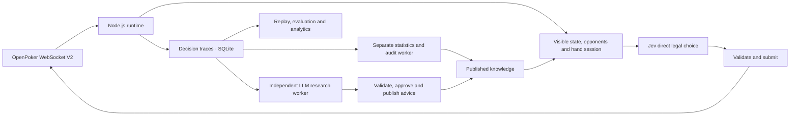

# jev-card-agent

[English](README.md) · [简体中文](README.zh-CN.md)

**An autonomous poker agent and decision-model evaluation platform powered by Jev, competing against real bots on OpenPoker.ai.**

[Watch the live arena and decision replay →](https://openpoker.zve.ccwu.cc)

Built with **Node.js 24, TypeScript, Fastify, React/Vite and SQLite**. OpenPoker provides six-max No-Limit Texas Hold’em, matchmaking, legal-action constraints and settlement. This project runs the self-hosted WebSocket V2 agent, records its decisions and evaluates its behavior.

## What you can inspect

| View               | What it shows                                                                                                              |
| ------------------ | -------------------------------------------------------------------------------------------------------------------------- |
| Overview           | Net profit, profitable-hand win rate, season score and score / profit curves                                               |
| Live table         | Community cards, the Bot’s own hole cards, all reported seat stacks, dealer button, chip animations and decision progress  |
| Replay & decisions | Events at each replay step, frozen inputs, legal candidates, model outputs, selected actions and execution acknowledgments |
| Evaluations        | Saved comparisons between Jev, the combined policy and baselines, with individual disagreements                            |
| Account funding    | Official account snapshots, freshness, auto-rebuy status, known cooldowns and persistent funding-event history             |

The public website is **anonymous and read-only**. It exposes the Bot’s own current hand and saved decisions for that hand, plus recorded completed hands. It has no Bot controls, strategy editing, key entry or paid-evaluation triggers. Visitors cannot change decision logic. Unrevealed opponent cards, action tokens and credentials remain private.

Live SSE updates and reconnects automatically. Every occupied seat labels **Available** (chips still available to bet) and **Bet** (the current street’s contribution, already included in the pot). Settled hands clear current bets and label the historical pot **Settled pot**. Every player’s displayed stack and the dealer button follow server state; sparse player summaries preserve seats they do not mention. Animations illustrate events without calculating authoritative balances. Older runs and hands load in pages of 100.

Overview shows settled profit and win rate for the selected run. Win rate is the share of verified hands with positive net profit; break-even hands remain in the denominator. For the current run, its season score uses the same official `seasonScore` account observation shown in Live, including after departure or stopping; it does not add the available balance and table stack. Missing official scores stay unknown, while restored or delayed observations retain their value with a stale label. Net profit excludes funding.

The run selector follows the current run by default. Selecting history pins that choice; selecting the current run again restores following. Historical scores show their last recorded source and time; older balance sums are explicitly labelled estimates, not official scores. Score curves do not join different seasons or legacy estimates onto current observations. Account details and funding events remain below the Live table; Overview stays statistics-only.

The top-right GitHub link opens this repository. In Live table, “Watch on OpenPoker” directly opens the current table’s official arena page in a new tab. The link remains available while the Bot reconnects or finishes its current hand before stopping and updates when the table changes. When stopped, unseated, or viewing a demo, the same entry is disabled and says “Waiting for a live table”; it never opens an old or synthetic table. The existing Run selector chooses recorded runs; it is unrelated to the official table link.

## How decisions work



The current implementation uses **pure Jev (`BOT_STRATEGY=jev`)** with a [poker harness](docs/harness.md): deterministic card and betting facts, position, street-sized legal candidates, current-hand context and completed opponent encounters. Jev makes the final choice. The runtime does not automatically rewrite strategy. Deployment and executed validation are recorded separately in the [verification report](docs/verification.md).

Version **1.3.0** adds optional [asynchronous LLM research](docs/async-llm.md). `BOT_STRATEGY=jev` keeps Jev as the action selector; `ASYNC_LLM_MODE=off` remains the default. Shadow research cannot alter Jev requests. Explicitly activated live research adds only approved, applicable suggestions to the next hand’s fixed knowledge. This mode is labelled Jev + asynchronous LLM assistance. The older synchronous `jev-reasoning` experiment remains separate.

Each hand has a persistent session. Following Pi’s separation of stored history and model context, the full event/decision history remains in SQLite while each request uses a compact projection. Unrelated recent profit streaks, repeated identifiers and duplicated context are omitted. Opponent memory uses at most 200 completed encounters per current opponent; completion and receipt must both precede the decision. Public showdown examples and street counts retain source evidence and sample limits. Missing price metadata is not guessed.

For successful Jev requests, records retain the original request and the schema-parsed `model`, `usage` and `answers`; they do not archive the verbatim HTTP response. Failed calls retain attempts, status and available diagnostic details, which may be incomplete.

Every submitted live action must come from Jev. Jev gets an initial attempt and **at most three retries**, with **10 seconds per request and 40 seconds for the whole decision**, always bounded by the platform action deadline. Costs are recorded for review and never impose a monetary limit. If no valid Jev result is available, the runtime records the failed decision, submits no locally chosen action and stops playing. This stop persists across restarts; an operator must explicitly resume through the private management interface. The platform may apply its own timeout action, which is not a Jev choice. Authentication, provider balance, model identity and ledger failures are not blindly retried.

Players who join during an already active hand wait for the next deal unless the server explicitly says otherwise. Their later membership confirmation does not invalidate an otherwise unchanged Jev decision. Repeated seat notifications preserve known hand participation and bets; each new hand resets participation. Actual changes to the turn, legal prices or participating players still invalidate old decisions. Provider retries do not bypass these checks.

Decision views preserve the supplied facts, actual provider output and final Jev choice. Card tools supply made hands, board texture and draws. A seeded 1,200-sample uniform-random showdown reference is stored as a separate asynchronous audit, with its assumptions and sampling error, but is **omitted from the actual Jev request**. It is not equity against the opponent’s betting range or action EV. Jev’s own probabilities are also not poker equity. Missing provider thinking is marked unavailable, never invented.

## Fast decisions and asynchronous knowledge

The normal live path makes one Jev request. A separate worker thread maintains deterministic statistics and random-range audits without waiting for an extra LLM. Each hand pins a published knowledge version, evidence cutoff and content hash across reconnects and restarts; current cards and actions keep updating. A paused or backlogged worker leaves decisions using existing eligible knowledge or an explicit baseline. An independent research worker can analyze completed evidence using the dedicated DeepSeek Messages adapter or configured Responses/Messages transport. It cannot submit actions or resume a stopped bot. Research receives its own credentials and sanitized evidence; the statistics worker receives neither model nor Arena credentials.

Live and Replay show the hand’s pinned knowledge, actual request, stage timings and asynchronous audit status. Later audits are separate additions, never presented as information supplied to Jev at decision time. Older records explicitly mark unavailable fields. Live keeps the table first and worker status below it; Overview remains statistics-only. Research status, review/publication history and actual advice adoption appear below Live and in Evaluations. Each decision shows advice provenance and exclusions. Private CLI operations handle approval, publication, withdrawal and explicit live activation; no controls are added to the public website. See the [async research operations guide](docs/async-llm.md) and [1.3.0 verification](docs/async-llm-verification.md); engineering tests and profitability are separate results.

## Prepare research without model calls

```sh
npm run research -- --op prepare --output data/research/prepared
npm run research -- --op status
```

Preparation reads verified completed live hands and writes private frozen batches. Configure dedicated `LLM_RESEARCH_*` settings before explicitly enabling research. Real diagnostics and paired Jev comparisons require `--allow-paid`; enabling live consumption also requires `--confirm-live`. The [operations guide](docs/async-llm.md) gives the full commands and migration/rollback procedure.

## Account chips and rebuys

The backend reads OpenPoker `season/me` when the runtime starts, every **15 seconds** while running, and after relevant events. The UI distinguishes off-table account chips, the REST account-at-table snapshot, live WebSocket seat stacks and historical net results. Failed refreshes retain the last value with a stale marker; unknown values are not displayed as zero.

A public-season rebuy credits **1,500 virtual chips** off table. Eligibility requires being off table, no chips at a table and fewer than 1,000 available chips; the first rebuy is immediate, with later cooldowns of 5 minutes on Free or 2 minutes on Pro. After confirmation, the runtime reloads the official balance before joining again. It does not add chips locally or count rebuys as poker profit.

Rebuy confirmations, scheduled cooldowns and balance reconciliations are stored in SQLite and shown in the public funding history. Restarting restores recorded history. Missing prior balances remain unknown, and observation counts are not presented as an exact count of platform transactions. See the [funding contract](docs/running.md#账户筹码牌桌筹码与自动补筹).

## Try the local demo

Requires **Node.js 24.x** and npm.

```sh
npm ci
npm run demo
```

Open **http://127.0.0.1:8787**. This builds the application and uses synthetic data in `data/demo.sqlite`, without API keys, real matchmaking or paid model calls. Demo, recorded history and live Arena data are labeled separately.

## Run a real agent

```sh
cp -n .env.example .env
chmod 600 .env
```

Fill in `OPEN_POKER_API_KEY` and `JEV_API_KEY` in your private `.env`, plus an independent `API_TOKEN` for internal administration; the browser never receives these credentials. Pure Jev needs no analysis-model key. `DEEPSEEK_API_KEY` is only needed when explicitly enabling the DeepSeek combined policy. See the [configuration guide](docs/running.md) for protocols, timeouts and cost records.

```sh
# Check platform authentication without joining a table.
npm run diagnose

# Join real matches with bounded hand count and runtime.
npm run bot -- --strategy jev --max-hands 10 --max-minutes 30
```

To serve the website and agent together, configure:

```dotenv
PUBLIC_HISTORY=true
AUTO_START_BOT=true
BOT_STRATEGY=jev
JEV_TIMEOUT_MS=10000
JEV_DECISION_TIMEOUT_MS=40000
```

Set these values explicitly after copying `.env.example`. Preserve the cost ledger when switching strategies. Auto-start has no hand or duration cap and enables auto-rebuy; a persisted model-failure stop blocks automatic play until an operator resumes it. There is no application monetary budget gate. Recorded raw game events and decision history are retained, while model session inputs stay bounded. Harness changes carry explicit versions and are compared on frozen inputs without assigning historical returns to alternative actions. Reconnecting to a previously observed turn reuses its original deadline; it does not grant another action window.

Then run `npm run build` and `npm run start`. Without auto-start, the server only serves the console. The standalone `bot` command is a separate entry point; use one runtime per Bot and database. Real model calls cost money, and hand/time limits do not guarantee that many hands will finish.

## Deploy and operate

Docker Compose runs the application with a persistent SQLite volume. From the deployment directory:

```sh
sh scripts/manage.sh start
sh scripts/manage.sh status
sh scripts/manage.sh logs
sh scripts/manage.sh backup
sh scripts/manage.sh resume
sh scripts/manage.sh stop
sh scripts/manage.sh restart
sh scripts/manage.sh update
```

`stop`, `restart` and `update` wait for the current hand to finish and confirm departure before replacing the process. `restart` uses the existing image; `update` pulls the configured image. Existing containers are left running by `start`.

GitHub Actions checks the project and automatically publishes **uncached `linux/amd64` and `linux/arm64` images**, pulling a fresh base image. **Server updates remain manual.** Normal updates preserve history and the model-cost ledger. See [deployment](docs/deployment.md) and [image releases](docs/docker-release.md).

This update preserves all existing runs, hands, decisions, raw events and cost records. The corrected runtime starts a new run carrying its code and context versions, so earlier fallback-contaminated samples remain reviewable without being mistaken for new Jev-only observations. Do not clear history during this update. A model-failure stop survives container restart and image updates; `sh scripts/manage.sh resume` invokes the protected `POST /api/runtime/resume` endpoint and starts with the configured strategy. The public website cannot resume play.

## Development and verification

```sh
npm run dev
npm run check
npx playwright install chromium
npm run test:e2e
```

Development uses Vite at `http://127.0.0.1:5173` and the API at `http://127.0.0.1:8787`. The main process serves the UI, API and runtime; a separate worker thread handles derived knowledge and audits. Checks cover formatting, lint, types, unit/integration tests, build output, file-size limits and credential hygiene. Browser tests use synthetic data and do not spend model credits. Maintained text files stay below 1,000 lines.

The frozen 2026-09-21 pure-Jev run had **295 verified settlements, −10,551 chips and 519 accepted Jev actions, with no local fallback**. Its losses drove the harness redesign; they do not establish a profitable replacement. Profitability remains a live evaluation objective, measured by net chips and bb/100 alongside sample size and drawdown. Historical provider probes and current verification remain in the [verification report](docs/verification.md).

## Documentation

- [Fast decisions and asynchronous knowledge](docs/fast-slow.md)
- [Pure Jev harness and evidence contract](docs/harness.md)
- [Architecture and scope](docs/architecture.md)
- [Evaluation methodology and cost accounting](docs/evaluation.md)
- [OpenPoker and model contracts](docs/transports.md)
- [Running, configuration and backups](docs/running.md)
- [Server deployment and manual updates](docs/deployment.md)
- [Docker image publishing](docs/docker-release.md)
- [Actual verification and limitations](docs/verification.md)
- [Contributing](CONTRIBUTING.md)

Detailed project documents are currently in Chinese. `.env`, credentials, raw databases and private deployment records stay outside public source and images.

Protocol sources: [OpenPoker Docs](https://docs.openpoker.ai/) · [TypeSafe API](https://docs.typesafe.ai/api).
