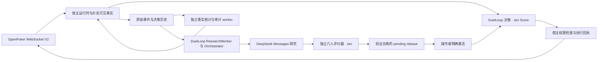

# jev-card-agent

[English](README.md) · [简体中文](README.zh-CN.md)

**基于 Jev 的自主扑克决策 Agent，通过 OpenPoker.ai 真实 Bot Arena 长期对战，持续记录、分析和评估模型决策质量。**

[公开演示、实时牌桌与复盘 →](https://openpoker.zve.ccwu.cc) · [DuelLoop 开源框架](https://github.com/hewenyu/DuelLoop)

采用 Node.js 24、TypeScript、Fastify、React/Vite 与 SQLite。OpenPoker 提供真实 6-max No-Limit Texas Hold’em、匹配、合法动作、结算和赛季积分；本项目通过 WebSocket V2 接入，不重建 Arena 服务器。

**v2.0.1 已部署至[公开演示站](https://openpoker.zve.ccwu.cc)，使用 DuelLoop v0.2.2 官方发行包。** 实时决策与策略研究生命周期由 DuelLoop 管理。[部署验收记录](docs/deployment-acceptance-v2.0.1.md)记录 2026-09-25 的上线过程、实际运行表现和验证范围；[此前验证报告](docs/duelloop-refactor-verification.md)保留为历史证据。

## 公开页面

| 页面               | 内容                                                                                     |
| ------------------ | ---------------------------------------------------------------------------------------- |
| Overview           | 已核实净收益、盈利手牌率、官方赛季积分及收益/积分曲线                                    |
| Live table         | 牌桌优先，Bot 手牌、庄家、各玩家可用筹码与当街下注、筹码动画、本手决策，以及官方牌桌跳转 |
| Replay & decisions | 原始事件、实际模型输入、合法候选、Score 回答、release/facts 绑定和执行结果               |
| 策略研究           | 后台生命周期、请求计数、验证引用和待激活版本；当前活动版本与本手固定版本分别显示         |
| 历史评估           | 旧版离线对照只读展示；动作一致率不代表替代动作盈利                                       |

网站**匿名、公开、只读**。凭据、动作授权 token、未公开对手底牌和私有研究产物不公开。Bot 控制和策略审批是经过鉴权的后端操作；页面通过 SSE 和有界 HTTP 查询刷新，不负责维持 Bot 运行。

座位可用筹码、当街下注、账户余额和官方积分分别标注。Overview 与 Live 共用最新官方积分快照，补筹不计入扑克净收益。胜率口径为盈利手数除以全部已核实手数，平局计入分母；它不是模型判断正确率。

## 唯一实时链路与独立双循环



- **每个实时动作由 Jev 决定。** SDK 对带具体金额语义的合法候选请求真实 Score，按版本化策略组合后选动作；人工审阅的初始策略使用 argmax。Score 是序数判断，不是筹码 EV 或扑克胜率；argmax 的 100% 选择概率也不是模型 100% 自信。
- **每手固定 release 和历史事实快照。** 当前牌面、下注和动作持续更新；重连、重启复用原绑定。新发布或回滚影响之后未固定版本的手，不能用今天的历史统计补写过去依据。
- **只有宿主能发送动作。** SDK intent、应用日志、行动身份、租约、合法金额与原始截止时间都必须匹配。收到 ack 与确认执行完成分别处理；重复回执去重，执行状态未知时阻断该 stream。
- **没有本地动作兜底。** Jev 初次请求后最多重试三次，默认单次 10 秒、整次决策 40 秒，并受原始 Arena 期限及提交预留约束。无效、过期结果不复用；真实决策故障保存停牌状态，需要明确恢复。
- **研究不串行等待当前动作。** 确定性事实与审计独立运行；LLM worker 使用 SDK 冻结证据、受控工具、取消/恢复及独立开发与最终评价。它持有研究和评价模型凭据，没有 Arena 执行密钥。
- **登记候选不等于激活。** 只有合格最终验证才能产生研究 release，默认操作者明确激活。中断的付费工作不自动重放；旧结算修订不算新增手数；评价 inconclusive 时保留原策略。

初始 bootstrap 策略已显式启用，但尚未通过独立统计验证。部署验收确认运行情况，不证明盈利能力。

**不设置金额预算门槛。** token 和不完整费用继续留存；时间、token、请求及评价调用限制用于防止研究任务失控。无法确认 token 用量时，研究任务可能停止，因为运行资源无法可靠计量；这不代表推断供应商余额不足，也不把未知费用写成零。

Baseline、Choice、Hybrid 保留用于离线对照和历史解码；真实运行拒绝 `BOT_STRATEGY=baseline` 或 `jev-reasoning`。生产 Controller 不启动旧 advice 队列和发布器。

## 本地演示

```sh
npm ci
npm run demo
```

需要 Node.js 24.x，访问 **http://127.0.0.1:8787**。Demo 明确标记合成历史，不需要 key、不连接 Arena，也不调用付费模型。

## 配置真实 Bot

```sh
cp -n .env.example .env
chmod 600 .env
```

在被 Git 忽略的 `.env` 填写 `OPEN_POKER_API_KEY`、`JEV_API_KEY` 和独立内部 `API_TOKEN`。为受控账户设置稳定的 `DUELLOOP_ACTOR_ID` 与 `DUELLOOP_SCOPE_ID`，不能每次进程启动都更换。

```dotenv
PUBLIC_HISTORY=true
BOT_STRATEGY=jev
AUTO_START_BOT=false
JEV_MODEL=jev-1.13.0
JEV_TIMEOUT_MS=10000
JEV_DECISION_TIMEOUT_MS=40000
DUELLOOP_EXECUTION_RESERVE_MS=1500
FACTS_ENABLED=true
DUELLOOP_RESEARCH_ENABLED=false
```

```sh
npm run diagnose
# 将开始真实对局；不要与同账户的另一个 Bot 同时运行。
npm run bot -- --strategy jev --max-hands 10 --max-minutes 30
```

一起提供网站与 Bot 时构建并启动服务器。准备持续运行后再明确配置 `AUTO_START_BOT=true`：不限制手数或时长，开启 auto-rebuy；已有持久失败停牌仍需私有管理入口恢复。迁移保留历史及调用账本。

## 开启异步研究

使用 `DUELLOOP_RESEARCH_API_KEY` 或已有 `DEEPSEEK_API_KEY`，精确模型名 `deepseek-flash`，采用其 Messages 端点。默认研究关闭 thinking；启用时 effort 默认 high。Jev 始终选择实时动作，也负责候选策略独立评价中的模型判断。

启用之前先锁定开发与最终评价参数。`prepare-protocols` 生成新的互不重叠私有种子，以禁止覆盖方式写文件，**不会调用模型**。下面变量应来自审阅过的实验计划；样本数与阈值必须在看到最终结果之前确定。

```sh
npm run research -- --op prepare-protocols --output data/protocols \
  --seed-blocks "$SEED_BLOCKS" --hands-per-seed "$HANDS_PER_SEED" \
  --min-samples "$MIN_SAMPLES" --minimum-improvement "$MIN_IMPROVEMENT" \
  --max-group-regression "$MAX_REGRESSION" --confidence "$CONFIDENCE" \
  --max-latency-ms "$MAX_LATENCY_MS"
```

配置 `DUELLOOP_RESEARCH_ENABLED=true` 和私有协议路径，再安全重启。协议缺失或无效时仅研究进入 `waiting_protocol`，实时决策继续。最终 holdout 用完后需要新的锁定协议；研究模型无法通过工具读取最终种子。

```sh
npm run research -- --op status
npm run research -- --op pause
npm run research -- --op resume
npm run research -- --op cancel --run RUN_ID
npm run research -- --op approve --release RELEASE_DIGEST --actor OPERATOR --reason REVIEW_REASON
npm run research -- --op rollback --release PRIOR_RELEASE_DIGEST --actor OPERATOR --reason REVIEW_REASON
```

这些命令访问已有私有服务，不另启竞争发布者。暂停研究、取消任务、暂停激活和停止 Bot 是不同操作。[研究集成](docs/duelloop-research-refactor.md)与[应用控制](docs/framework-application-integration.md)说明详细合同。

## 部署与数据留存

GitHub Actions 自动检查并无缓存构建 `linux/amd64`、`linux/arm64` 镜像，拉取新基础镜像；**服务器更新始终由操作者手动通过 Docker Compose 执行**。

```sh
sh scripts/manage.sh status
sh scripts/manage.sh backup
sh scripts/manage.sh update
sh scripts/manage.sh logs
```

`stop`、`restart`、`update` 先完成当前手，再由官方确认离桌，随后替换进程。保留原始库、facts 库、DuelLoop 库、旧版历史归档和私有评价协议；不要开第二个 Bot 或清空历史来迁移。[部署说明](docs/deployment.md)包含配置迁移、备份和回滚；[v2.0.1 验收记录](docs/deployment-acceptance-v2.0.1.md)记录已完成的生产部署。

OpenPoker 核心玩法使用虚拟筹码。离桌、无在桌筹码且可用筹码低于 1,000 时可以 rebuy 1,500；首次立即，Free 后续冷却五分钟，Pro 两分钟。后端重新确认官方余额后再入队，并将补筹记录与净收益分开。

## 验证与开发

2026-09-24 历史集成验证：四个 Choice/Score 成对案例中三个选择相同；DeepSeek 只读工具回合耗时 1,494 ms；独立评价器在两个成对 seed block 中完成 36 次真实 Jev 调用。**评价结论为 inconclusive，且早于 session 合同修正。这些样本不能验证新合同，也不证明盈利或两种协议等价。** 详见[验证报告](docs/duelloop-refactor-verification.md)。

[v2 审计修复记录](docs/duelloop-v2-audit-fixes.md)说明同回合取消恢复、线上与评价器共享 session，以及全部迁移数据库的 Compose 挂载交接。这些修复已包含在上线的 v2.0.1 中；之后的服务器更新仍由操作者明确执行。
生产依赖使用正式的 [DuelLoop v0.2.2 发布包](https://github.com/hewenyu/DuelLoop/releases/tag/v0.2.2)，通过固定 URL 与 lockfile 校验值锁定；详见[包来源记录](vendor/README.md)。

```sh
npm run check
npm run test:e2e
node scripts/verify-duelloop-package.mjs
```

检查包含格式、lint、类型、单元/集成测试、构建、仓库约束与公开只读页面行为。纳入维护的文本文件小于 1,000 行。生产 SDK 来自[固定公开源码与包 provenance](vendor/README.md)，干净安装不依赖相邻开发仓库。

- [架构](docs/architecture.md)
- [DuelLoop 实时与回放合同](docs/duelloop.md)
- [独立扑克评价器](docs/poker-evaluation.md)
- [事实服务](docs/facts-service.md)
- [迁移、部署与回滚](docs/deployment.md)
- [Docker 自动构建](docs/docker-release.md)
- [历史验证记录](docs/verification.md)
