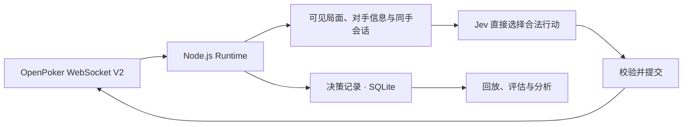

# jev-card-agent

[English](README.md) · [简体中文](README.zh-CN.md)

**基于 Jev 的自主扑克决策 Agent 与模型评估平台，通过 OpenPoker.ai 与真实 Bot 持续对战。**

[实时观战与决策回放 →](https://openpoker.zve.ccwu.cc)

技术栈为 **Node.js 24、TypeScript、Fastify、React/Vite 和 SQLite**。OpenPoker 提供六人桌无限注德州扑克、匹配、合法动作约束与结算；本项目负责自托管 WebSocket V2 Agent 的运行、决策记录和行为评估。

## 可以查看什么

| 视图               | 展示内容                                                                 |
| ------------------ | ------------------------------------------------------------------------ |
| Overview           | 净收益、盈利手牌胜率、赛季积分及积分 / 收益曲线                          |
| Live table         | 公共牌、Bot 自己的底牌、所有已报告座位筹码、庄家按钮、筹码动画和决策阶段 |
| Replay & decisions | 当前回放位置的事件、冻结输入、合法候选、模型输出、最终行动及执行确认     |
| Evaluations        | 已保存的 Jev、组合策略与 baseline 对比，及具体决策差异                   |
| Account funding    | 官方账户快照、更新时间、自动补筹状态、已知冷却和持久资金事件历史         |

公开网站**匿名只读**，展示 Bot 自己的当前手牌、本手已保存决策，以及已结束牌局。网站不提供 Bot 控制、策略编辑、密钥输入或付费实验入口，访客不能改变决策逻辑。未公开的对手底牌、行动授权与鉴权凭据保持私密。

实时 SSE 自动更新并重连。每个已入座玩家分别标出 **Available（可下注筹码）** 和 **Bet（当前街已下注，已计入底池）**。结算后本轮下注归零，历史底池标为 **Settled pot（已结算底池）**。所有玩家的座位筹码与庄家按钮以服务端状态为准；稀疏玩家摘要保留没有提及的座位。动画只呈现事件，不用于计算权威余额。较早的 Run 和手牌按每页 100 条加载。

Overview 专注所选 Run 的完整历史战绩。胜率为净收益大于零的已核实手牌占比，平局计入分母；赛季积分来自已记录的官方账户快照，包含补筹，净收益不含补筹。两条曲线自动刷新。账户明细及补筹事件位于 Live 牌桌下方，逐手记录在 Replay 查看。

## 决策如何运行



本轮部署目标是 **纯 Jev（`BOT_STRATEGY=jev`）**：将可见局面、同手 session、对手统计和历史摘要交给 Jev，直接从合法候选中选择行动。当前重点是数据采样，目标是先持续运行数小时积累真实牌局与决策数据，再复盘并设计策略对照；这不表示已经采足数小时样本。当前不会在线自动修改策略。此处描述部署目标，实际上线与验收状态见[验证报告](docs/verification.md)。

专用 **DeepSeekProvider** 和标准 Responses / Messages 适配器保留为可选组合策略实验。只有显式选择 `jev-reasoning` 并配置相应 provider 时才请求额外分析；纯 Jev 不调用 DeepSeek、GPT 或 Claude。

每手建立持久 session。输入包含截止当前决策的可见行动历史、带样本数的对手统计、最近已核实战绩和本手此前决策，并受输入大小限制；较早上下文未进入本次模型请求时，数据库中的历史仍然保留。回放保留当时保存的输入，不补入之后才知道的信息。

成功的 Jev 请求保存原请求及 schema 解析后的 `model`、`usage`、`answers`，并非逐字保存 HTTP 响应。失败调用保留 attempts、状态和可取得的部分诊断，不能假定拥有完整失败响应。

正式运行提交的每个行动必须来自 Jev。Jev 首次调用后**最多重试三次**，**单次 10 秒、整次决策 40 秒**，同时遵守平台当前行动期限。费用只记录，不设置金额门槛。无法得到有效 Jev 结果时，记录失败、不提交本地选择的动作并停牌；该状态跨重启保留，须通过私有管理入口显式恢复。平台可能自行执行超时动作，该动作不能算作 Jev 决策。鉴权、供应商余额、模型身份和账本错误不盲目重试。

决策视图展示已保存分析、供应商实际返回的思考文本或摘要、Jev 候选概率与最终选择。未返回思考时明确显示缺失，不生成补写。Jev 选项概率不是扑克胜率或预期盈利。

## 账户筹码与自动补筹

后台在 Runtime 启动时、运行中每 **15 秒**及相关事件后读取 OpenPoker `season/me`。界面区分离桌可用筹码、REST 账户在桌快照、WebSocket 实时座位筹码与历史净收益。刷新失败保留最后值并标记过期，未知值不显示为零。

公开赛季每次 rebuy 向离桌余额增加 **1,500 虚拟筹码**。条件为已离桌、没有在桌筹码且可用筹码少于 1,000；首次立即可用，此后 Free 冷却 5 分钟、Pro 冷却 2 分钟。确认后 Runtime 重新读取官方余额再入队，不在本地加筹码，也不将补筹算作扑克盈利。

补筹确认、冷却安排与余额核对保存到 SQLite，并公开展示资金事件历史。重启后恢复已记录历史；缺失的补筹前余额保持未知，观察记录条数不等同于平台精确交易次数。详见[账户与补筹口径](docs/running.md#账户筹码牌桌筹码与自动补筹)。

## 本地演示

需要 **Node.js 24.x** 和 npm。

```sh
npm ci
npm run demo
```

打开 **http://127.0.0.1:8787**。命令构建应用，并使用 `data/demo.sqlite` 的合成数据；无需 API Key，不加入真实比赛，也不调用付费模型。界面分别标识 Demo、历史记录与 Live Arena。

## 运行真实 Agent

```sh
cp -n .env.example .env
chmod 600 .env
```

在私有 `.env` 填写 `OPEN_POKER_API_KEY`、`JEV_API_KEY`，另设独立 `API_TOKEN` 用于内部管理；浏览器不会接收这些凭证。纯 Jev 无需分析模型密钥，`DEEPSEEK_API_KEY` 仅在显式启用 DeepSeek 组合策略时需要。协议、超时和费用记录见[运行手册](docs/running.md)。

```sh
# 检查平台鉴权，不加入牌桌。
npm run diagnose

# 加入真实对局，并限制运行时长和模型费用。
npm run bot -- --strategy jev --max-hands 10 --max-minutes 30
```

同时运行网站与 Agent 时，配置：

```dotenv
PUBLIC_HISTORY=true
AUTO_START_BOT=true
BOT_STRATEGY=jev
JEV_TIMEOUT_MS=10000
JEV_DECISION_TIMEOUT_MS=40000
```

复制 `.env.example` 后显式设置以上值。切换策略保留费用账本。自动启动不限制手数和时长，启用 auto-rebuy；如已因模型失败停牌，则保持停牌直至私有管理入口显式恢复，不因重启自动绕过。程序不按金额阻止模型调用。已记录的原始牌局事件与决策历史持久保存，模型输入使用有界 session；后续注入 harness 的复盘结论应版本化，并在同一组冻结输入上比较。

随后执行 `npm run build` 和 `npm run start`。未开启自动启动时只提供控制台页面。独立 `bot` 命令是另一运行入口，同一个 Bot 和数据库只运行一个 Runtime。真实模型调用产生费用，手数和时长上限不保证完成对应数量的牌局。

## 部署与运维

Docker Compose 运行应用，SQLite 保存在持久卷。进入部署目录后执行：

```sh
sh scripts/manage.sh start
sh scripts/manage.sh status
sh scripts/manage.sh logs
sh scripts/manage.sh backup
sh scripts/manage.sh resume
sh scripts/manage.sh stop
sh scripts/manage.sh restart
sh scripts/manage.sh update
```

`stop`、`restart` 和 `update` 等待当前手牌结束并确认离桌后才替换进程。`restart` 使用已有镜像，`update` 拉取配置的镜像；`start` 不替换已经运行的容器。

GitHub Actions 自动检查，并**无缓存发布 `linux/amd64` 与 `linux/arm64` 镜像**，构建时重新拉取基础镜像。**服务器保持手动更新。** 常规更新保留历史和模型费用账本。详见[部署手册](docs/deployment.md)与[镜像发布流程](docs/docker-release.md)。

本次更新保留所有已有 Run、手牌、决策、行动、原始事件及费用记录，不清理历史。修正后的 Runtime 使用新 Run，并保存代码与上下文版本；旧版本中包含 fallback 的样本继续保留供复盘，不混充新的纯 Jev 数据。模型失败停牌跨容器重启和镜像更新保留。`sh scripts/manage.sh resume` 通过受保护的 `POST /api/runtime/resume` 显式恢复，并按当前配置启动；公开网页没有恢复参赛权限。

## 开发与验证

```sh
npm run dev
npm run check
npx playwright install chromium
npm run test:e2e
```

开发环境 Vite 地址为 `http://127.0.0.1:5173`，API 为 `http://127.0.0.1:8787`。生产环境由一个 Node.js 进程提供界面、API 与 Runtime。检查覆盖格式、lint、类型、单元/集成测试、构建、文件行数与凭据卫生。浏览器测试使用合成数据，不消费模型额度。每个维护文本文件少于 1,000 行。

项目记录了真实 Arena 运行和 provider 调用，但没有证明长期盈利或策略优势。近期 Opus 5 和 Sonnet 5 的 `high` 探针均在分析阶段超时，只验证了 Jev 合法继续决策，**没有验证 high 强度分析成功**。供应商也可能不返回思考内容。实际证据与限制见[验证报告](docs/verification.md)。

## 文档

- [架构与范围](docs/architecture.md)
- [评估方法与费用记录](docs/evaluation.md)
- [OpenPoker 与模型接入合同](docs/transports.md)
- [运行、配置与备份](docs/running.md)
- [服务器部署与手动更新](docs/deployment.md)
- [Docker 镜像发布](docs/docker-release.md)
- [实际验证与限制](docs/verification.md)
- [参与开发](CONTRIBUTING.md)

详细项目文档目前使用中文。`.env`、凭据、原始数据库与私有部署记录不进入公开源码或镜像。

协议来源：[OpenPoker Docs](https://docs.openpoker.ai/) · [TypeSafe API](https://docs.typesafe.ai/api)。
