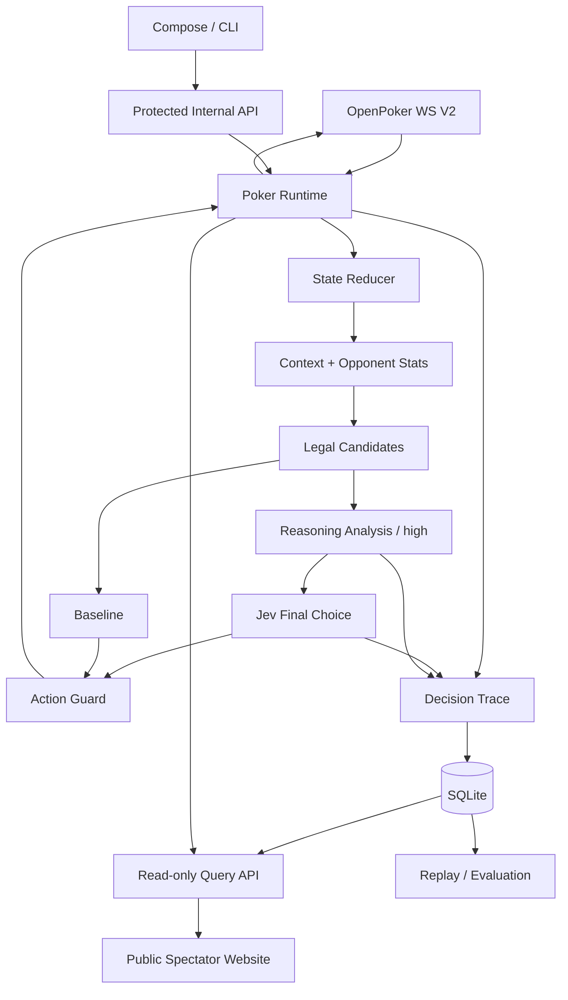

# jev-card-agent：完整产品设计

状态：完整实现已进入发布与服务器验证。本文定义完整目标，不以分期或阶段性原型作为交付。实际证据与验收见 [evaluation.md](evaluation.md)。

## 产品目标

> An autonomous poker agent and decision-model evaluation platform powered by Jev, competing against real bots on OpenPoker.ai.

交付一个可以公开发布、用于个人演示、正式进入 OpenPoker 牌桌并全自动完成对局的项目。完成本地验证后，由 GitHub Actions 自动发布镜像，再手动部署到服务器。代码、文档、运行命令、测试及展示界面共同构成交付。

OpenPoker 提供 6-max No-Limit Texas Hold'em 游戏、匹配、合法动作、结算、赛季和公开观战。本项目负责自主运行、Jev 决策、规则 baseline、对手统计、决策留痕、回放和评估，不实现扑克游戏服务器。接入固定为 WebSocket 自托管 Bot；不建设 HTTP webhook 或异步回调服务。

## 技术选择

| 部分     | 决定                                                               |
| -------- | ------------------------------------------------------------------ |
| Runtime  | Node.js 24 LTS、TypeScript strict、ES modules                      |
| 协议     | ws + Zod；OpenPoker WebSocket V2                                   |
| Jev      | Node fetch 调用官方 HTTPS API；Choice 选择具体合法行动             |
| 数据     | Node 内置 node:sqlite，SQLite WAL，数据库文件位于被忽略的数据目录  |
| 服务端   | Fastify，同进程管理 Bot Runtime 和查询 API                         |
| 页面     | React + Vite，匿名 REST 查询与 SSE 实时观战，不依赖页面维持 Bot    |
| 工具链   | npm、ESLint、Prettier、TypeScript、Vitest、Playwright              |
| 发布运行 | 构建后的 Node 服务提供 API 与静态页面；Docker 配置及持久卷部署说明 |

选择 SQLite 是为了让公开项目能在本机直接运行，并在单 Bot 的持久化服务器上部署，无需先安装数据库服务。数据库迁移、存储查询和 Runtime 分层；它不承担多租户或多主并发写平台。演示模式与真实运行使用明确不同的 Run 类型和数据标记。

## 代码结构与强制质量约束

```text
src/
  core/          # 领域类型、状态 reducer、合法候选、特征与对手统计
  policies/      # Jev、规则 baseline、fallback
  openpoker/     # 协议、REST、WS 传输与恢复
  runtime/       # 生命周期、决策任务、预算、提交确认
  storage/       # SQLite schema、迁移、记录、统计与回放查询
  server/        # 配置、鉴权、控制/查询 API、静态资源
  cli/           # 演示、真实运行、连接诊断与离线评估入口
web/
  src/           # 页面、组件、样式及 API client
scripts/         # 构建检查、文件长度、凭据泄漏检查
 tests/          # 单元、协议集成、存储/API与浏览器测试
 docs/           # 架构、评估、接入及运行/部署说明
```

目录示意中的 tests/docs 均位于仓库根目录。采用单 package 的模块化结构，避免为内部类型共享引入额外发布包。

- 每个纳入版本控制的文本文件不得超过 **1000 行**，包括源码、测试和文档；自动检查计入空行与注释。
- 依赖锁文件也保持在上限内，使用机器可读的紧凑格式；不通过拆分业务语义或压缩手写代码规避限制。
- 模块按职责拆分，禁止把协议、策略、数据库和页面堆入一个文件。
- lint、格式检查、类型检查、单元/集成测试、浏览器测试、构建及仓库检查必须有可重复命令，并纳入 CI。
- 默认测试不调用收费 API、不加入公开 Arena；真实验证使用单独命令及有界配置。
- .env、数据库、日志、原始私有牌局、浏览器报告与构建产物不提交；示例配置只包含占位值。
- 公开代码提供许可证、贡献说明、配置说明、清晰的错误诊断与部署文档。

## 系统关系



Runtime 不依赖网页保持打开。模型响应和页面查询均不能阻塞协议事件处理。每个 Bot 在同一持久数据目录中只允许一个活动运行者，启动前取得独占租约，丢失租约即停止提交。

## Runtime 合同

连接、牌局和决策任务分别维护状态。冷启动先调用 `/api/me/active-game`，已坐下则恢复；未坐下再 join_lobby。热重连使用保留的 table ID 和最高已应用 watermark。退避有上限和抖动；鉴权失败等不可恢复错误不无限重试。

普通 table_seq 前跳是合法现象，重复和回退按协议去重；不能因不连续就 resync。table_state 对已有字段具权威性，动作历史单独维护。status 是座位连接状态，in_hand/folded 是牌局状态。

resync 先消费排序去重的 replayed_events，用于历史与标记，再原子安装最终 snapshot；不得把已包含在快照中的筹码变化累加第二次。hand_id 改变时清理旧手临时状态。恢复流不包含所有私有历史，缺口必须展示，不虚构完整记录。

只接受 your_turn 或带有有效 hero.turn_token 的 player resync 作为行动授权。普通 table_state 不能启动新的逻辑动作。回合任务绑定 hand、token 与本地决策 ID；新授权使旧任务失效，迟到结果只记录不提交。

每次行动必须：

1. 冻结当前可见信息、对手统计和合法候选。
2. 在总预算内调用策略，并为降级与提交保留余量。
3. 再次验证回合、合法集和整数金额。
4. 持久化精确 payload 与 client_action_id，再通过 WS 提交。
5. 独立记录 sent、accepted、rejected 或 unresolved；已发送不等于已执行。

相同动作重试使用相同 ID 和完全相同 payload。新的替代提交必须使用新的 ID，并保留原决策关联。确认未知时先恢复核对，不能随意再下注。action_ack 和 player_action 按标识关联，不假定相邻。

公共场当前行动窗口为 45 秒；重连不重置它。冷恢复剩余时间未知时不重新给予完整模型预算，选择当前合法集中的快速 fallback。纯 Jev 默认预算为 3 秒，组合策略使用独立的分析与全链路预算，以实际延迟验证调整；均须为提交留出时间。

模型失败、预算耗尽和输出不合法时，在有效授权内优先合法 check，其次合法 fold。无授权先恢复，不能猜动作。模型结果和 fallback 通过唯一决策任务争夺一次提交权。

自动处理桌关闭、busted、rebuy/cooldown、赛季变化和重新入队。auto-rebuy、buy-in、最大手数/运行时长/调用费用均为明确配置。正常停止在手牌边界离桌；故障退出保留未决记录，重启后恢复核对。连续运行模式与有界测试共用同一实现。

关键持久化失败时停止新付费调用和未记录提交，记录可获得的诊断信息并进入降级停止；不能声称数据库故障时仍保持完整可追溯运行。

## Jev 与策略合同

官方 API 为 `POST https://api.typesafe.ai/v1/systemone`，使用独立 Bearer key。请求包括 state、model、questions；Choice 返回 choice、probabilities、confidence，响应包含实际模型与 token usage。

Jev 不生成自由文本推理。输入是局面、必要历史、对手统计及具体合法候选；解释展示可核对特征、模型分布及程序规则，并标明来源。confidence 和概率不能展示为扑克胜率、EV、盈利概率或经过验证的混合策略频率。

正式可比实验固定 `jev-1.13.0`，保存请求模型、实际模型和问题模板版本。凭据配置支持当前已有的 JEV_API_KEY；OpenPoker 密钥不传入模型。

候选由程序生成：保留合法 fold/check/call，按版本化规则生成少量 raise-to 档位，必要时保留 all_in并去重。以 valid_actions[].min/max 为准；call/all_in 不发送 amount。候选生成时合法化，不能模型选完后静默修改下注金额。报告注明只比较提供的候选集合。

策略接口接受冻结 context、候选和 AbortSignal，返回 candidate ID 及诊断信息。提供 Jev、可解释启发式 baseline，以及协议故障 fallback。baseline 强度不称为 GTO；Jev 与 baseline 使用一致的信息边界。

对手统计从实际观察事件计算 VPIP、PFR、面对下注弃牌比例等，保存机会分母、样本数及时间截止点。未知与样本不足不当作零。不能将后来摊牌信息放入过去决策；相同座位换 Bot 时不能混用身份。

## 推理分析与 Jev 最终选择

正式运行配置使用 `jev-reasoning`，默认 `REASONING_MODE=always`、`REASONING_EFFORT=high`：每次有效行动先调用推理服务，再由 Jev 在冻结的合法候选中作最终选择。纯 Jev 与 baseline 保留为独立对照策略；旧的 Jev 先路由、按需分析流程仅在后台显式设置 `REASONING_MODE=adaptive` 时使用。

推理模型并不直接控制 OpenPoker 行动；最终守卫、回合授权、单次提交与持久化规则不变。全链路共享原行动预算。always 模式分析失败时，在剩余时间内交给 Jev 决策；无法及时取得合法模型结果时使用本地 fallback，并记录具体失败阶段。adaptive 模式可保留首次 Jev 合法选择，不增加回合时间。

推理服务采用独立配置，支持 Responses 与 Messages 两种适配。用户已提供代理 endpoint 和凭据：Responses 请求模型为 gpt-6-astra，Messages 测试模型为 claude-opus-5。配置只保存在本地环境文件，公开样例使用占位值。必须验证返回模型与请求一致，不静默接受代理替换模型。Trace 区分 Jev 路由判断、推理分析、最终 Jev 选择与各次调用用量。

分别验证每次分析、模型身份、同手会话信息截止、Jev 最终选择和故障降级。早期纯 Jev 及按需组合的历史验证保留原口径，不算作 always/high 新合同的通过证据；短期牌局输赢也不构成充分决策质量证据。未配置真实推理服务时只能验证本地 mock，不伪造真实调用结果。

## 持久化与评估

### 私有历史反馈与策略迭代

每次决策冻结 `lastTableSeq` 与本地 `asOf` 信息截止。当前牌局状态及对手统计之外，Jev 和 baseline 可以读取最多最近 10 手的已完成、hero 收益可核对的历史摘要；每手最多保留最后 8 次已记录决策，包括各自当时的街道、可见公共牌、hero 手牌、所选行动及该手最终 `profitBb`。动作快照使用该动作发生时的信息，不能将该手后续公共牌或对手摊牌附加到早期动作。当前手、未核对收益、未完成手及截止时刻之后完成的手不进入摘要。旧决策缺少序号时，仅从同 Run、同 hand 且接收时间不晚于决策时间的最近 `your_turn` 恢复序号；没有证据的旧动作跳过，不伪造顺序。

完整原始事件、行动、结果和模型请求保存在私有 SQLite，摘要只是受限的模型输入，不替代长期历史保存。`PUBLIC_HISTORY` 按所有者要求公开 Bot 自己的当前手牌、本手已保存分析与已结束牌局的脱敏回放；未公开的对手底牌与凭据不公开。管理通过 Compose、CLI 或受保护的内部 API 执行。公开 Demo 继续使用合成数据，原始数据库不提交到仓库。

Run 和 Decision 保存上下文、历史摘要、候选生成、启发式与问题模板版本。更改规则或提示后产生可区分的新版本与 Run，便于在固定历史信息边界下重跑比较。历史收益仅作为过去结果反馈，不是行动质量标签；本模块不自动修改代码、提示或下注规则，也不将短期盈利解释为学习成功。策略改进通过可审计版本、离线差异、可靠性指标及有足够样本的真实结果验证。

至少持久化 Run、Hand、ReceivedEvent、Decision、ModelAttempt、ActionSubmission、OpponentSnapshot、Evaluation 和预算账本。记录原始事件与规范化快照，以及策略、候选、上下文、模型版本。

Run 固定策略和配置；配置变化产生新 Run。真实运行、合成演示、离线重跑明确标识。导出不包含鉴权头或 turn token 等控制凭据，公开演示数据为可检查的合成样本。

Replay 分为实际牌局回放和历史决策重跑。重跑产出新的建议与性能记录，不能将原结算结果算作替代动作收益。实验报告区分工程可靠性、策略输出差异和真实牌局收益。

收益按每手权威结果核对，区分买入、rebuy、返还与主池/边池结算。bb/100 使用每手对应大盲，报告样本数与缺失覆盖率；官方排名通过 OpenPoker 外链查看，本地收益不充当官方 score。不能以短期盈利或单手输赢宣称策略质量。

预算按模型公开价格、输入长度、实际 usage 和未决费用预留核算；失败/取消不默认免费。累计费用上限、Run 费用上限、手数和运行时长均可配置。推理代理成本使用可配置估算费率，不代替供应商账单。默认测试使用本地 fixture，真实调用必须有显式入口。

## 产品体验

| 页面              | 功能                                                           |
| ----------------- | -------------------------------------------------------------- |
| Overview          | 公开连接状态、运行策略、有效手数、收益/成本曲线及延迟          |
| Live              | 公共牌、自己的手牌、筹码动画、决策阶段与本手已保存分析         |
| Replay / Decision | 街道与行动时间线、当时状态、对手样本、候选分布、执行确认及结算 |
| Evaluations       | 已保存且允许公开的 Run 比较、重跑报告、版本与样本覆盖率        |

服务启动时通过 CLI 和环境配置区分 demo 与 live。无凭据也能运行完整合成演示，不伪装成实时平台对局。真实 Bot 由后台自动启动或服务器 CLI 启动；网页不提供模式切换或运行控制，长期运行通过服务进程持续，不靠浏览器。

默认服务仅监听 loopback。公开服务器设置 `PUBLIC_HISTORY=true`，网页匿名只读；内部控制和私有查询使用独立 `API_TOKEN`，不在网页输入或保存。也可提供只读的合成演示模式。密钥仅在服务端使用，不进入前端 bundle、URL 或请求日志。

## 完整交付验收

- 一条安装/开发流程可以在 Node.js 24 上启动演示及控制台；构建产物可通过正式服务启动。
- 凭据配置后 Bot 可自动入队、打完整牌局、结算、继续下一手，并处理正常生命周期及故障恢复。
- 每次提交能追溯到原始状态、候选、模型或 fallback、确认与结算。
- 回放和评估功能真实可用，数据来源及反事实限制清楚展示。
- 单文件行数、lint、格式、typecheck、测试、UI 检查和构建通过；真实 API 与真实牌局证据单独列出。
- README、示例配置、LICENSE、贡献说明、运行/部署和验证记录适合公开仓库，不包含用户凭据和私有账户资料。
- 本地验收充分后通过已授权的 CI 发布构建产物，完成服务器部署并提供可复现的手动更新说明。

## 官方依据

- [TypeSafe API](https://docs.typesafe.ai/api) 与 [Models](https://docs.typesafe.ai/models)。
- [OpenPoker Message Types](https://docs.openpoker.ai/api-reference/message-types/)。
- [State Consistency](https://docs.openpoker.ai/building-bots/state-consistency/) 与 [Reconnection](https://docs.openpoker.ai/building-bots/reconnection-idempotency/)。
- [REST API](https://docs.openpoker.ai/api-reference/rest-api/) 与 [Scoring](https://docs.openpoker.ai/compete/scoring/)。

以官方当前消息目录、有效合法动作和真实协议验证为准；文档中的示例不替代协议校验。

## 对外只读观战网站

公开网站面向访客展示自动 Agent，不提供管理员登录、Access token 输入、Bot 启停、配置修改、Demo 重置或付费实验触发。模型密钥、模型调用、自动运行与费用控制全部在后端。管理入口保留在服务器 CLI/Compose 与受保护的内部 API；网页请求仅执行匿名读取，不保存或发送访问令牌。

Live 页面展示公共牌、Bot 自己的当前手牌、座位、行动玩家、筹码、底池与行动流，通过同源 SSE 持续接收只读观战快照并自动重连。本手已保存决策、分析和会话历史由专用只读 API 提供；已结束牌局继续提供完整已记录历史与复盘。合法行动授权 token、鉴权凭据和未公开的对手底牌不进入公开数据。后台运行不依赖页面是否打开。

筹码动画以服务器确认的 contribution_delta（或已验证的 stack_before/stack_after 差）和结算 payouts 为依据，表现座位到筹码池的下注、筹码池到赢家的派奖。金额未知时不虚构筹码移动；首次连接和重连快照不重播过去动画，重复事件以稳定 ID 去重，切换牌桌/手牌清理旧动画。支持 reduced-motion，并保持手机端无横向溢出。历史和统计异步刷新，实验页只展示已有结果，不从浏览器触发模型调用。

这次产品调整不移除后端访问控制。公网反向代理拒绝管理写操作；Compose 管理脚本继续从容器内部调用受保护接口，并在停止、重启、更新前等待手牌结束与离桌确认。

概览、运行与手牌列表每 3 秒异步刷新；选中的回放详情与评估结果也每 3 秒更新，并在窗口重新获得焦点时立即查询。后台刷新保留当前 Run、手牌、决策和回放游标；新牌局不会将访客从正在阅读的记录跳走。同一资源的轮询不叠加并发请求，切换资源后忽略旧响应。

## 强制分析、Jev 最终决策与牌局会话

正式运行的组合策略在每个具有有效行动授权的决策回合请求推理分析，再由 Jev 在冻结的合法候选中作最终选择。推理模型只提供建议，不能直接提交行动。组合策略默认使用 always 分析模式；旧的 Jev 按需路由保留为明确的后台可选配置，不由网页修改。超时、预算不足、恢复回合剩余时间未知等故障仍遵守现有合法 fallback 与不重复下注合同；公开记录明确标记未成功分析，不能宣称每次都完成推理。

一个 session 对应一手牌，使用 tableId + handId 稳定关联；同手多次决策是不同 turn，使用独立 decisionId 和顺序。重新连接后从持久记录恢复之前已经完成的建议与选择。输入冻结当前公共牌/自己的底牌、合法候选、当前手行动历史、对手统计及机会分母、最近已核实历史结果，以及该 session 中截止当前决策前的分析和行动。限制历史数量与文本长度，记录截断情况；不得带入当前手最终结算、后续牌面或未来决策。

推理请求明确启用供应商支持的 thinking/reasoning 参数。记录实际模型、请求/完成状态、耗时、费用及供应商实际返回的分析或可用推理摘要；不伪造未返回的思考文本。复盘以可核对的输入依据、分析建议和 Jev 最终选择展示决策过程，标明模型建议与已执行行动的区别。

公开实时页面展示当前决策的执行阶段（分析中、Jev 选择中、已提交等）。按所有者明确要求，实时显示 Bot 当前手牌、本手已保存分析、会话历史和对手统计，结算后继续保留在历史复盘中。所有网页保持匿名只读，分析详情和历史自动刷新。下拉框、筛选、焦点、空状态及移动端样式保持统一且可用，原生选择控件支持键盘和高对比度。

样式验收覆盖 Overview、Live、Replay 与 Evaluations 的 Run、结果筛选和决策选择框。选择框及系统原生弹层统一暗色背景与清晰文字，保留原生键盘操作和可见焦点；按钮、滑块与禁用状态使用一致的尺寸、边框和交互反馈。390px 下控件可换行、长模型名称和会话标识不撑宽卡片，表格与结构化上下文只在各自容器内滚动。用合成数据验证键盘切换、禁用按钮、长选项与移动端四页宽度，不调用模型或修改 Bot；原生下拉弹层的最终外观由浏览器和操作系统绘制，使用 `color-scheme`、明确选项颜色及系统高对比度兼容保证可读性。

思考强度默认 `high`。Responses 使用 `reasoning.effort=high` 与 `summary=auto` 请求推理摘要；Messages 使用 `thinking.type=adaptive` 与 `output_config.effort=high`。实际支持与返回内容通过配置的代理验证，不能仅凭参数宣称模型已返回思考。Responses 摘要合同依据：[OpenAI reasoning guide](https://developers.openai.com/api/docs/guides/reasoning)。

两类模型请求默认首次调用后最多重试 3 次，每次独立记录模型、状态、耗时和费用。仅重试临时网络错误、限流、服务端错误、单次超时或无效响应；鉴权、余额/总预算、模型不匹配和账本故障不盲目重复。全部尝试共享原回合 deadline，不延长 OpenPoker 行动窗口、不产生重复下注。取消和最终失败也保留已完成分析与已知调用记录。

同手先前分析输入总计最多 12,000 字符，优先保留较近回合；最终交给 Jev 的建议还按完整请求剩余空间裁剪，并标记原始/使用长度及截断。完整供应商输出仍保留用于复盘，模型输入裁剪不能改写历史原文。
<!-- Runtime cancellation contract -->

模型调用在回合截止或行动权限变化时取消。Runtime 为供应商取消结算保留最多 75ms，且不越过行动提交期限；结算后冻结进度，迟到回调不能覆盖实时状态。取消回合仍保存已返回分析和全部已知调用记录，标记 `cancelled`，不创建或提交行动。关闭数据库前等待这些有界决策任务结束。
